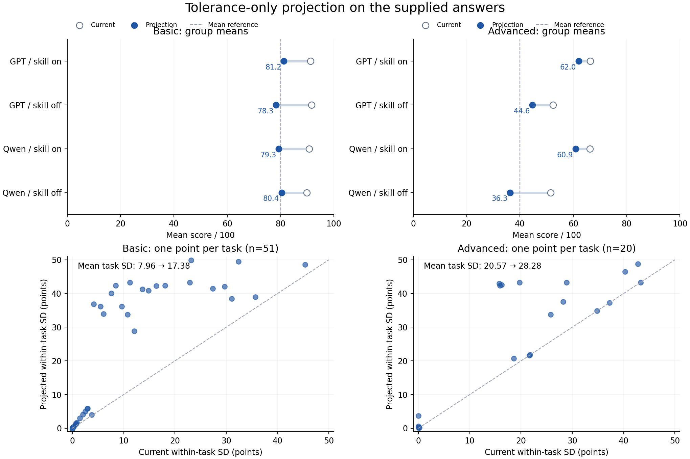

# Property Calculation 容差投影实验

日期：2026-09-16。状态：离线实验；没有修改正式 `scoring.yaml`。

后续修订：[2026-09-17 按性质统一的容差策略](2026-09-17-property-tolerance-policy.md)
已取代本文逐题拟合的候选建议。本文及其脚本、CSV 保留为历史实验记录，不再作为
当前推荐参数；新策略在读取答卷前冻结各性质的误差锚点。

## 结论

仅修改每题数值字段的左右容差，能够扩大这批答案的分数差异。Basic 的改善也出现在
按 skill 条件留出的检验中；Advanced 目前只有样本内改善，尚不能证明这种改善会稳定
延续到新的作答。两模型的总体排名也未得到可靠区分，不能把此次投影解释为 GPT
显著优于 Qwen。

最终遵循本轮澄清后的优先级：**不同答案的区分度优先；各实验组的 80/40 分均分只是参考**。
不把四组总均分达标当作各组达标，也不通过改变标准答案、字段权重、匹配或变换规则来凑分。

| Track | 同题四组标准差的跨题均值：原 → 投影 | 同题六对答案的平均绝对分差：原 → 投影 | 四组均 ≥90 分的题数：原 → 投影 | 四组全零题数：原 → 投影 |
| --- | ---: | ---: | ---: | ---: |
| Basic，51 题 | 7.96 → **17.38**（+118.5%） | 10.19 → **22.04** | 27 → 19 | 0 → 0 |
| Advanced，20 题 | 20.57 → **28.28**（+37.5%） | 26.28 → **34.97** | 1 → 0 | 2 → 0 |

增大分差也会使部分答案被截断为零：Basic 单次作答零分率从 **0.49% 增至 9.31%**，
Advanced 从 **21.25% 增至 28.75%**。四组全零题减少与个别答案零分增加可以同时发生；
这项代价没有从结果中排除。



## 各实验组结果

下面的标准差、中位数和零分率均基于该组的全部题目；所有分数均为百分制。
组内跨题标准差与上表“同题四组标准差”是不同指标，不能混用。

| Track | 模型 | Skill | 原均分 | 投影均分 | 投影中位数 | 投影跨题标准差 | 投影零分率 |
| --- | --- | --- | ---: | ---: | ---: | ---: | ---: |
| Basic | gpt5.6-sol | on | 91.27 | **81.24** | 91.50 | 30.04 | 5.88% |
| Basic | gpt5.6-sol | off | 91.55 | **78.31** | 91.65 | 33.33 | 7.84% |
| Basic | qwen3.8-flash | on | 90.64 | **79.35** | 94.56 | 35.23 | 11.76% |
| Basic | qwen3.8-flash | off | 89.84 | **80.39** | 92.27 | 31.83 | 11.76% |
| Advanced | gpt5.6-sol | on | 66.37 | **62.03** | 84.37 | 43.57 | 20.00% |
| Advanced | gpt5.6-sol | off | 52.35 | **44.63** | 35.37 | 43.62 | 35.00% |
| Advanced | qwen3.8-flash | on | 66.23 | **60.92** | 78.81 | 42.53 | 20.00% |
| Advanced | qwen3.8-flash | off | 51.54 | **36.32** | 22.74 | 36.96 | 40.00% |

Basic 四组均接近 80 分。Advanced 的两个 skill-off 组接近 40 分，两个 skill-on 组
仍在 61–62 分附近，**没有达到各组都接近 40 分的参考期望**。本方案保留了数据中的
这一差异，没有把均分作为强制约束。

完整的样本数、均值、中位数、标准差、四分位数、零分率、≤10 分率、≥90 分率、满分率
及均分区间见 [group_statistics.csv](2026-09-16-property-tolerance-projection/group_statistics.csv)。

## 模型之间的差异

“有符号均分差”是 GPT 减 Qwen，能反映方向；“平均绝对分差”先对每题取绝对值再平均，
能反映答案是否被拉开，但不能证明某模型总体更好。

| Track / 条件 | 原有符号均分差 | 投影有符号均分差 | 原 → 投影平均绝对分差 | 投影有符号差的 95% 区间 |
| --- | ---: | ---: | ---: | --- |
| Basic / on | +0.63 | +1.89 | 12.40 → 27.74 | [-11.66, 15.20] |
| Basic / off | +1.71 | -2.09 | 10.16 → 19.80 | [-13.18, 9.12] |
| Advanced / on | +0.14 | +1.11 | 19.23 → 28.77 | [-20.81, 23.75] |
| Advanced / off | +0.81 | +8.31 | 34.10 → 39.25 | [-16.23, 33.14] |

两个 skill 条件先在同一题内等权平均，再比较模型：Basic 的 GPT−Qwen 为 **-0.10 分**，
95% 区间 [-9.23, 9.39]；Advanced 为 **+4.71 分**，区间 [-11.44, 21.50]。
所有有符号差区间都跨零。因此，本实验支持“许多不同答案的分数差变大”，
**不支持“已经稳定区分两模型的总体优劣”**。

## 输入及复现核对

| Track | 原文件（位于 `review_system/data/shared-files/`） | 工作表 | 题目行 | 作答列 | v0.9.2 分数列 |
| --- | --- | --- | --- | --- | --- |
| Basic | `99d73931db2f439c80453dd9adfaecb0.xlsx` | 结果汇总 | 5–55 | E/H/K/N | G/J/M/P |
| Advanced | `f1b6a8d8836e4cbc9f72e5f452feb0bc.xlsx` | 工作表 1 | 5–24 | E/H/K/N | G/J/M/P |

- 基线为源码基点 `248259a` 的 v0.9.2 配置与正式 `PropertyCalculationEvaluator`。
- 核对全部 71 个 task ID、77 个 gold 字段以及 284 个已记录分数。最大误差分别为
  4.9895×10⁻⁷ 和 5.0000×10⁻⁷（原始 0–1 尺度），符合表格六位小数的舍入误差。
- 不使用表格里的旧版说明文字重写评分逻辑。Advanced 若干备注仍描述旧版最小值聚合，
  v0.9.2 实际使用字段算术平均；该行为由正式评分器复现。
- Advanced 020 的 Qwen skill-off 作答为空，按既有缺失字段规则记零，保留在 20 题分母中。
  Basic 四组均完整。表格末尾的汇总行不参与再次平均。
- 原工作簿保持原样；没有把原始模型回答复制进 Git。原文件、任务、评分和 verifier
  配置的 SHA-256 记录在 [summary.json](2026-09-16-property-tolerance-projection/summary.json)，
  脚本结束时再次核对这些文件没有变化。

## 容差选择方法

### 固定的评分规则

对数值字段仍使用现有规则：

```text
z = 现有变换(x)；G = 现有变换(gold)
score = max(0, 1 - abs(z - G) / tau_side)
tau_side_new = tau_side_old × k_task
```

同题的全部数值字段、两侧容差使用同一个正倍率 `k_task`。字符串及 atom identity
规则、标准答案、单位检查、缺失值、非正 log10 输入、无序最佳匹配、字段等权算术平均
全部交给正式评分器处理。每个候选倍率均重新调用该评分器，尤其不复用旧分数推算
原来为零的答案，也不冻结旧的无序匹配结果。

`log10` 题的容差单位是 **log10 空间的宽度（decades）**；不是原始 `s^-1` 或 `eV`
的加减宽度。其有效原始数值范围为 `(gold × 10^-tauL, gold × 10^tauU)`。
`absolute` 题继续对绝对值评分，不能把本轮投影解释为新增符号约束。

### 候选范围与目标

每题扫描 301 个对数均匀倍率，并将倍率保留三位有效数字、去重后评估。范围是本次
实验的参数搜索范围，**不是科学上最优容差的证明**：

| 数据情况（按各组的数值字段平均分判断） | 允许倍率 | 用意 |
| --- | --- | --- |
| 四组数值分都 ≥80 | 0.1–0.5 | 对普遍高分题缩窄至少一半，至多十倍 |
| 四组数值分都 ≤10 | 1–10，且投影数值均分 ≥20 | 放宽低分题，让答案回到线性区间；无效输入仍不给分 |
| 其余数值题 | 0.1–1 | 在既有宽度内检查可分辨的差异 |
| 纯非数值题 | 1 | 没有数值容差可调 |

混合题按数值字段判断是否处于零分区域，所以 Advanced 002 的数值字段也被识别为需要
放宽；它原本依靠两个正确字符串字段得到 66.67 分，不能由任务总分发现数值部分的问题。

在上述范围内，选择最大化下式的倍率：

```text
U(k) = Var(同题各实验组的任务分数，0–1 尺度) - lambda × ln(k)^2
```

方差衡量同题答案的分数展开程度；惩罚项抑制为追求方差而把宽度推到极端。
这是**离线选参数的实验目标**，不是新的 benchmark 评分公式。
目标中不包含模型名称、GPT−Qwen 的方向、模型排名或均分硬约束。
交换四组顺序不会改变选出的倍率。

比较 `lambda ∈ {0, 0.003, 0.01, 0.03, 0.1}`：Basic 选择 0.03，在保留明显区分度
提升的同时让各组均分约为 80；Advanced 选择 0.003，优先保留区分度，0.01 在此数据上
产生相同结果。它们都是在当前资料上探索选择的，不能当作预注册参数。

参数极限若仍无法改善全无效输入，脚本保留原倍率并标记不可恢复；不会通过放宽容差
为缺失、错误单位或非法 log10 输入制造分数。本批最终没有此类不可恢复的整题分组。

## 逐题变更与无法解决的情况

Basic：49 道数值题缩窄，044、046 两道原子身份题固定。
Advanced：11 题缩窄、3 题放宽、6 题固定。77 个字段的旧/新左右容差、变换、gold、
单位及 profile ID 全部列在 [candidate_tolerances.csv](2026-09-16-property-tolerance-projection/candidate_tolerances.csv)。
每题四组原分/新分、倍率及标准差变化见 [task_scores.csv](2026-09-16-property-tolerance-projection/task_scores.csv)。
下面只列解释主要效果所需的例子，宽度均位于现有评分空间：

| 题目 | 原宽度 → 候选宽度 | 效果或限制 |
| --- | --- | --- |
| Basic 010 水二聚体结合能 | 3 → 0.57 kcal/mol | 同题标准差增加 32.43 分；原本被宽容差掩盖的误差明显展开 |
| Basic 013 A–T 结合能 | 3 → 0.339 kcal/mol | 同题标准差增加 32.68 分 |
| Basic 024 N–O 键级 | 0.18584 → 0.03698216 | 同题标准差增加 33.93 分 |
| Advanced 002 晶相势能差 | 1 → 7.88 eV | 数值部分由全零进入线性区间；两个相名字段照旧评分 |
| Advanced 009 HOMO–LUMO gap | 2 → 4.62 eV | 四组全零被消除，但投影同题标准差只有 0.27 分 |
| Advanced 011 孔体积比 | 0.5 → 2.07 | 四组全零被消除，但投影同题标准差只有 0.62 分 |
| Advanced 012 羧酸氢距离 | 0.5 → 0.183 Å | 同题标准差增加 27.23 分 |
| Advanced 017 磷光速率 | 2 → 0.76 decades | 同题标准差增加 26.32 分，保留 log10 线性评分 |

Advanced 009 的四个答案约为 3.56–3.58 eV，gold 为 7.26 eV；011 的答案约为
0.044–0.076，gold 为 1.713。放宽可以消除零分截断，但这些答案本来就非常接近，
无法由此得到很大的可靠分差。Advanced 008、010 也几乎是相同答案，投影标准差仍
分别只有 0.09、0.23 分。这些现象也值得后续核对计算协议；本轮不修改 gold 或题干。

Basic 020、029 四组提交同一个数值；044、046 四组精确命中身份答案。这四题始终同分。
Basic 仍有 19 题的四组最高与最低分差小于 1 分（原来 20 题），因此改善主要发生在
原本存在实质答案差异的题上，不能声称已经消除了所有分数拥挤。

## 留出检验与不确定性

按题目进行配对 bootstrap，固定随机种子 `20260916`、10,000 次重采样；同一题四组
一起抽取，避免把 4N 条相关回答当成独立样本。报告的是百分位 95% 区间。
同题标准差增量的样本内区间：Basic [6.15, 12.80] 分，Advanced [3.71, 12.38] 分。
这些区间**以已选容差为条件**，不包含选择参数的乐观偏差。

另外分别执行两次条件留出：只使用两个 skill-on 答案选择每题倍率，评估 skill-off；
以及反向执行。分类门槛、候选筛选和方差目标只看训练组，不查看被留出的答案。
lambda 沿用上面的探索值，**没有独立留出选择 lambda**，所以这仍是部分留出检验，
不是完全独立的泛化证据。

| Track | 选择参数 → 评估条件 | 留出组原绝对分差 | 留出组投影绝对分差 | 增量的 95% 区间 |
| --- | --- | ---: | ---: | --- |
| Basic | on → off | 10.16 | 17.08 | [3.25, 11.04] |
| Basic | off → on | 12.40 | 21.30 | [4.73, 13.62] |
| Advanced | on → off | 34.10 | 34.98 | [-9.34, 10.16] |
| Advanced | off → on | 19.23 | 16.88 | [-13.13, 7.02] |

Basic 的两个方向都显示绝对分差改善。Advanced 的区间均跨零，其中一个方向反而
下降，因此不能宣称这套 Advanced 容差已经得到稳定验证。所有数据仍来自相同题目、
两个模型、每种条件一次回答；没有独立重复运行，不能估计生成随机性。

固定候选宽度整体再乘 0.8 或 1.2，Basic 同题标准差为 17.45/14.76，Advanced 为
27.46/26.15，均高于原来的 7.96/20.57。完整参数扫描与宽度敏感性结果见
[sensitivity.csv](2026-09-16-property-tolerance-projection/sensitivity.csv)。这些也是同批答案的敏感性分析。

本轮建议：保留 Basic 候选进入新的独立作答验证；Advanced 候选作为探索记录，
先补充独立作答和核对上述共同偏差题。当前数据尚不足以把两条 track 的方案都认定为
最终有效的正式评分规则，因此这轮继续保留原 `scoring.yaml`。

## 复现及检查

在仓库根目录，使用已安装本项目及 `numpy`、`openpyxl` 的 Python 环境：

```bash
PYTHONPATH=src .venv/bin/python docs/research/2026-09-16-property-tolerance-projection/project_scores.py
```

也可用 `--source-dir` 指向两份原表，用 `--output-dir` 输出到临时目录。缺少文件、未知/
重复 task ID、gold 不一致、记录分数缺失或基线无法复现时会报错，不会静默剔除样本。
正式 YAML、原始文件及评分实现没有写入路径。

```bash
.venv/bin/pytest -q tests/test_property_tolerance_projection.py tests/evaluation/property_calculation tests/evaluation/common/scoring tests/task/test_task_pack_v2.py tests/test_property_calculation_tasks.py tests/test_property_calculation_easy_tasks.py tests/test_property_answer_extraction.py
.venv/bin/ruff check docs/research/2026-09-16-property-tolerance-projection/project_scores.py tests/test_property_tolerance_projection.py
```

检查覆盖基线复现、只修改内存中的数值容差、冻结配置保持不变、模型顺序不影响选参、
留出答案不影响选参，以及缺失/单位错误/非正 log10 输入保持零分。165 项测试通过；
有一条已有 CIF 文件缺少 formula keys 的解析提示。工作簿另经公式重算、均值独立核对、
输入扰动刷新检查、公式错误扫描和逐表视觉检查。
